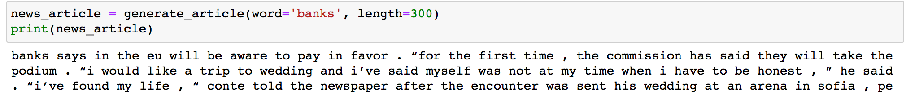

# Financial News Generation using LSTM model 

In this project, we will generate our own Financial News using RNNs.  We will be using Financial news published by Bloomberg.com, CNBC.com, reuters.com, wsj.com and fortune.com as our training dataset.  The Neural Network will then generate a new ,"fake" Financial News article, based on patterns it recognizes in this training dataset. Given an English word  and the article length, the sample output of this project looks like below:



## Project Instructions

### Instructions

1. Open your terminal and clone the repository, then navigate to the the project folder.
```
git clone https://github.com/AndyTKH/Natural-Language-Processing.git                                                          
cd Natural-Language-Processing
```
2. Open the notebook to view the project. 
```
jupyter notebook finance_news_generation.ipynb
```
3. Simply close the terminal window to exit Jupyter Notebook. 
